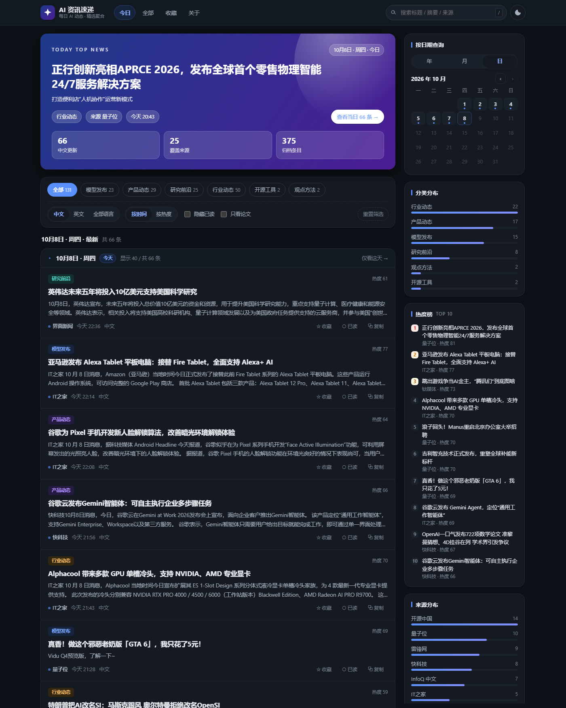
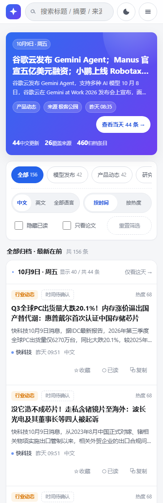

# AI 资讯速递

**线上主站：<https://latestainews.cn/>**（阿里云 OSS · 香港地域，免备案，每天北京时间 06:00 自动更新）
**海外备用：<https://githublizh.github.io/ai-news-daily/>**（同一条流水线发布，互为备份）

一个自建的 AI 资讯聚合站：每天抓取国内外公开 RSS 源，去重、分类、按天归档后写入一份静态 JSON，
页面纯前端渲染。没有账号、没有广告，适合自己和朋友每天花几分钟扫一眼 AI 圈发生了什么。

参考效果：[ai.codefather.cn/news](https://ai.codefather.cn/news)（资讯流 + 日期查询 + 热度榜）。



## 特性

- **按天归档的资讯流**：默认「最新」视图把全部归档按天从新到旧铺开，日期分组 + 粘性表头，
  跨源转载自动合并并标注「另见」（凌晨时段最新一天可能只有零星几条，头条与统计会自动带上前一天）
- **日期查询日历**：年 / 月 / 日三级切换，有数据的日期带标记，可一键跳到某天
- **分类筛选**：模型发布 / 产品动态 / 研究前沿 / 行业动态 / 开源工具 / 观点方法；
  分类条数会随语言、搜索、已读等条件实时变化，但不会因为「已经选了某个分类」而把其它分类抹掉
- **搜索**：标题、摘要、来源、转载来源全文匹配，按 `/` 快速聚焦
- **默认只看中文**：打开就是中文资讯流，想看的英文用「英文 / 全部语言」一键切换，选择会记在本地
- **热度榜与来源分布**：侧栏实时统计当前范围的分类、来源与 TOP 10
- **收藏与已读**：浏览器本地记录，支持「隐藏已读」和只看收藏
- **站点自带订阅源**：每次抓取同步导出 `data/feed.xml`，可直接加进 RSS 阅读器
- **一条命令打包**：`npm run build` 生成 `dist/`，丢到任意静态托管即可发布
- **深色模式 / 手机适配 / 可分享 URL**：`#/day/2026-10-08`、`#/all/cat/研究前沿` 等状态直接进地址栏；
  手机上没有横向滚动、首屏就能看到资讯，控件按触控尺寸放大（见「移动端适配」）
- **零运行时依赖**：只用 Node 内置能力，无 `node_modules` 也能跑

## 快速开始

需要 Node.js 20 及以上版本（依赖内置 `fetch`、`node:test`）。

```bash
# 1. 抓取资讯，生成 data/news.json
npm run fetch

# 2. 本地预览
npm run dev          # http://127.0.0.1:5173

# 3. 运行单元测试
npm test
```

> 直接双击 `index.html` 会因为浏览器安全策略无法读取 `data/news.json`，请用 `npm run dev` 打开。

## 命令

| 命令 | 说明 |
| --- | --- |
| `npm run fetch` | 抓取全部启用的源，写入 `data/news.json` 与 `data/feed.xml` |
| `npm run fetch -- --dry` | 只抓取与统计，不写文件 |
| `npm run fetch -- --only=qbitai,openai` | 只抓指定源，便于调试单个源 |
| `npm run build` | 生成可发布的 `dist/` 目录 |
| `npm run dev` / `npm start` | 启动本地静态预览服务（`PORT`、`HOST`、`CACHE_SECONDS` 可覆盖） |
| `npm test` | 运行 `test/` 下的单元测试 |
| `npm run check:mobile` | 用本机 Chrome / Edge 无头校验移动端布局（零依赖，找不到浏览器时自动跳过） |
| `npm run check:lines` | 抽样多条线路的 DNS / TCP / HTTPS 可达性与延迟（`--n=8` 调抽样次数，也可直接传 URL） |

## 移动端适配



站点按「手机优先显示资讯」设计，断点与约定如下：

| 断点 | 行为 |
| --- | --- |
| `> 1080px` | 桌面端：资讯流 + 右侧粘性侧栏双列 |
| `≤ 1080px` | 单列，侧栏移到资讯流之后 |
| `≤ 860px` | 手机/小平板模式：顶栏 56px、搜索框 44px、hero 压到两行标题、分类芯片一行横向滚动、筛选控件两行网格、日期分组表头保持单行 |
| `≤ 460px` | 顶栏只留 logo（隐藏品牌文字） |
| `≤ 860px 且高 ≤ 720px` | 短屏（横屏手机、小屏老机型）：hero 只留头条 + 「查看当天」入口，保证首屏看得到资讯 |

- **触控目标**：主操作（收藏 / 已读 / 复制）不小于 44×44，次要控件不小于 40px 高；
  这套尺寸同时作用于 `(pointer: coarse)` 的宽屏触摸设备。
- **悬停态**：全部收在 `@media (hover: hover) and (pointer: fine)`，避免触摸点击后高亮粘住（桌面端鼠标行为不变）。
- **iOS**：搜索框字号 16px，避免聚焦时整页被放大；`viewport-fit=cover` + `env(safe-area-inset-*)` 处理刘海屏横屏。
- **移动端菜单**：汉堡菜单内有「日期查询 / 热度榜」快捷跳转（桌面端隐藏），点导航链接、点菜单外或按 Esc 都会自动收起。
- 回归口径由 `npm run check:mobile` 自动断言：320 / 360 / 375×667 / 390 / 414 / 768 六档零横向溢出、
  顶栏不被挤破、首屏可见首条资讯、触控目标达标，另外在 1280px 下回归桌面端双列布局与悬停态。

## 目录结构

```
├─ index.html               # 站点入口（发布根目录即仓库根目录）
├─ assets/
│  ├─ styles.css            # 设计变量 + 布局/组件样式（含深色模式）
│  ├─ app.js                # 前端逻辑：加载 JSON、渲染、日历、收藏、交互
│  └─ filters.mjs           # 纯逻辑层：筛选/计数/地址栏解析（有单元测试覆盖）
├─ data/
│  ├─ feeds.json            # 资讯源配置（启停、权重、相关性、时区修正）+ 站点信息
│  ├─ news.json             # 聚合产物，由 npm run fetch 生成并提交进仓库
│  └─ feed.xml              # 站点自身的 RSS 订阅源，随每次抓取更新
├─ scripts/
│  ├─ fetch-news.mjs        # 抓取 + 归一化 + 写盘
│  ├─ build.mjs             # 组装可发布的 dist/
│  ├─ serve.mjs             # 零依赖本地静态服务器
│  ├─ mobile-check.mjs      # 移动端/桌面端布局回归检查（无头浏览器 + CDP）
│  └─ lib/
│     ├─ rss.mjs            # 极简 RSS/Atom 解析、日期解析
│     ├─ normalize.mjs      # 相关性判断、分类、去重、按天分组、热度
│     ├─ feed.mjs           # 导出站点 RSS
│     └─ text.mjs           # HTML 清洗、实体解码、URL 规范化、语种识别
├─ test/                    # node:test 单元测试
├─ dist/                    # npm run build 产物（已 gitignore）
└─ .github/workflows/       # 定时刷新数据，同时发布到 GitHub Pages 与阿里云 OSS
```

## 数据管线

1. **抓取**：并发请求 `data/feeds.json` 中 `enabled` 的源，超时 25s，网络类错误最多重试 3 次。
2. **相关性过滤**：`relevance: "ai"` 的源照单全收（它们本身就是 AI 垂类媒体）；
   `relevance: "tech"` 的综合科技源**只按标题**判断——标题命中 AI 关键词才保留。
   实测发现按正文判断会把「苹果 iPad 发布」「显示器上市」这类稿件一并收进来，
   因为正文里出现一次 “AI / NVIDIA” 就够了，所以改成只看标题这一条更稳定的信号。
   每次抓取还会用当前规则重新裁决历史数据，规则调整后不需要手动清库。
3. **归一化**：清洗 HTML 与实体、压缩空白、摘要截断到 220 字、按规范化 URL 计算稳定 id。
4. **去重**：先按规范化 URL，再按标题归一化 key 判重；跨源转载合并为一条并记录 `alsoIn`。
5. **分类**：关键词打分，标题命中记 3 分、摘要记 1 分，取最高分分类，无命中落到「行业动态」。
6. **归档**：按 `Asia/Shanghai` 换算自然日分组，保留 `retentionDays`（默认 45 天）内的条目，
   总量上限 `maxItems`（默认 2500），每次抓取都会与已有数据合并，因此历史不会被新抓取冲掉。
7. **热度**：`0.5 × 时效衰减（36 小时半衰期）+ 0.25 × 来源权重 + 0.25 × 热点关键词命中`，
   归一到 0~100；只作为排序辅助，不代表真实阅读量。
8. **导出**：同时写出 `data/feed.xml`（最近 120 条），便于用 RSS 阅读器订阅。

### 源配置字段

```jsonc
{
  "id": "qbitai",
  "name": "量子位",
  "url": "https://www.qbitai.com/feed",
  "home": "https://www.qbitai.com",
  "lang": "zh",
  "weight": 2.2,            // 1~3，影响热度
  "relevance": "ai",        // ai=整站 AI；tech=综合科技站，需关键词过滤
  "timeShiftHours": -8,     // 可选：源站时区标错时做小时级修正
  "bulk": true,             // 可选：高频源（如 arXiv）
  "bulkLimit": 20,          // 可选：每日按新闻性择优保留条数
  "timeoutMs": 45000,       // 可选：单源超时覆盖
  "enabled": true
}
```

## 部署

```bash
npm run fetch && npm run build     # 生成 dist/
```

站点是纯静态产物，把 `dist/` 作为站点根目录发布即可（也可以直接发布仓库根目录）。

- **GitHub Pages（备用线路）**：仓库已带 `.github/workflows/refresh-and-deploy.yml`，每天北京时间 06:00
  自动抓取、提交 `data/news.json` 与 `data/feed.xml`、构建 `dist/` 并发布站点；
  **同一条流水线会同时更新 GitHub Pages 与阿里云 OSS（国内主站）**。换仓库时需在
  `Settings → Pages → Build and deployment` 把 Source 选为 **GitHub Actions**。
- **Vercel / Netlify**：构建命令填 `npm run fetch && npm run build`，发布目录填 `dist`。
- **本地自用**：`npm run fetch && npm run dev`，局域网内其他设备可通过 `HOST=0.0.0.0` 访问。

### 国内访问不稳定怎么办

`githublizh.github.io` 在境内会间歇性打不开。原因不在站点本身，而在 `*.github.io` 这个域名：
它的 DNS 常被污染，GitHub Pages 又走 Fastly，到 185.199.108–111.153 的连接会被丢包或重置；
GitHub Pages 没有国内节点，也没有官方国内加速，这一点无法通过优化站点解决。

2026-10-10 在本机实测：DNS 解析其实是**正确**的（四个 IP 全部命中），但 HTTP 首包要 2.1s——
说明「有时候打不开」多半不是解析失败，而是到 Fastly 的连接被丢包或重置。同一时刻的对照：
`pages.dev`（Cloudflare 默认域名）能连上但握手要 5.1s；作为对照，一家走境内节点的边缘加速平台入口只要 1.0–1.6s
——这就是「境外节点」和「境内节点」的量级差。单次采样只代表量级，部署后请按本节末尾的命令在自己的网络上复测。

好消息是本项目是**零外部依赖的纯静态产物**：`index.html` 与 `assets/app.js` 引用的都是相对路径
（`data/news.json`、`assets/styles.css`），页面里不加载任何境外 CDN、字体或第三方脚本。
**换托管不需要改任何代码**，把 `dist/` 换到别处发布即可；抓取管线跑在 GitHub Actions 的海外机器上，
也不受国内网络影响。

#### 方案 A（本仓库选用）：阿里云 OSS · **香港地域**（免备案，需要自备域名）

> 📋 **要动手就直接看这份清单**：[docs/deploy-oss-hongkong.md](deploy-oss-hongkong.md)
> —— 从买域名、建 Bucket、绑域名、配 HTTPS 证书到配 CI 的可勾选步骤。

OSS 就是阿里云的"静态网站托管"，但有两个硬约束，先看清楚再决定
（[阿里云 OSS 静态网站托管文档](https://help.aliyun.com/zh/oss/user-guide/hosting-static-websites)）：

> ⚠️ **1. OSS 送的默认域名不能当网站入口。** 官方原文：使用 OSS Bucket 域名访问 HTML 文件时，
> 出于安全考虑**浏览器会强制下载而非在线预览**，要实现网页正常浏览**需要绑定自定义域名**。
> 也就是 `bucket.oss-cn-*.aliyuncs.com` 只能当文件下载地址。
>
> ⚠️ **2. Bucket 在中国内地时，绑定的域名必须先完成 ICP 备案**（官方原文）。反过来，
> **Bucket 放在中国香港 / 海外地域则无需备案**（如 `oss-cn-hongkong`），代价是走境外节点。

所以：**这条路的前提是你有一个域名**。本项目选的是**香港地域**——免备案、按量计费、走境外节点，
总成本就是域名年费。（实测香港线路 4/4 可达、DNS 正常、TCP p50 382ms，见文末「先实测」：
它是**慢**，不是**断**，和 `github.io` 那种时好时坏不是一回事。）

1. 建 Bucket：地域选 **中国香港**（endpoint `oss-cn-hongkong.aliyuncs.com`），这是本项目的选择，**不需要备案**；
   想换大陆节点就把地域改成中国内地，但那时必须先备案（见文末「备案要点」）；
2. 开静态网站托管：`数据管理 → 静态页面`，默认首页填 `index.html`，默认 404 页填 `error.html`，错误码选 404；
3. 开公共读：`权限控制 → 阻止公共访问` 先关掉，再把 `读写权限` 设为 **公共读**（新建 Bucket 默认是私有）；
4. 绑自定义域名：把域名 CNAME 到该 Bucket 的外网 endpoint；内地 Bucket 要先备案，香港 Bucket 可直接绑；
5. 上传与更新：用下面的 workflow 自动同步，或手动把 `dist/` 里的内容传到 Bucket 根目录。

> 这个站的 `#/day/2026-10-08` 是 **hash 路由**，用标准静态网站托管就够，不需要配 SPA 重写规则。
> 页面全部走相对路径，所以绑子域名（如 `news.example.com`）也能直接跑。

#### 费用（按本项目的真实用量算）

本站 `dist/` 实测只有 **574 KB**，首屏 479 KB（其中 `data/news.json` 402 KB），
50 次访问/天约 720 MB/月。这个量级下费用几乎可以忽略：

| 计费项 | 单价 | 本项目的量 | 月费用 |
| --- | --- | --- | --- |
| 标准存储（本地冗余） | **0.12 元/GB/月**（官方文档明确） | 574 KB ≈ 0.0006 GB | ≈ ¥0.0001 |
| 外网流出流量 | 按量，单价见[官方定价页](https://www.aliyun.com/price/detail/oss) | 约 720 MB/月 | 按常见量级**估算** <¥1 |
| 请求次数 | 按量 | 每天几百次 | 忽略不计 |
| 域名 | — | — | ¥30~90/年（随促销波动，以注册商为准） |

> ⚠️ **香港地域不享受新用户免费试用额度。** 阿里云免费试用页写明该额度地域是**「中国内地通用」**，
> 官方注释：*"只能抵扣中国内地各地域的对应计费项，不能抵扣中国香港和海外地域的对应计费项"*。
> 所以本方案是按量计费——但按上表算，**每月就是几毛钱**。
> （[官方文档](https://help.aliyun.com/zh/oss/free-quota-for-new-users)的「叠加使用」小节另提到中国香港等地域有
> 每月 5GB 存储 / 5GB 外网流出的固定额度，但它与试用页「中国内地通用」的关系我未能确认，**请以账单为准**。）
>
> 想用上试用额度就得把 Bucket 建在**中国内地**，而内地 Bucket 绑自定义域名**必须先备案**
> （备案要买一个可备案实例，首年约 ¥70~150）——**为省每月几毛钱去花这笔钱不划算**，所以仍选香港。

> 因为选了香港地域，不需要 ICP 备案，所以**没有"可备案实例"那笔一次性开销**——
> 总成本是**域名年费 + 每月几毛钱的按量费用**。

#### 附：如果以后要换成大陆节点（备案要点）

阿里云在 OSS 场景有个**很省事的地方**：官方规定 OSS 绑自定义域名时**只要求"域名在工信部存在 ICP 备案号"，
备案信息不强制接入阿里云**（[官方备案场景文档](https://help.aliyun.com/zh/icp-filing/basic-icp-service/product-overview/use-oss)）。
也就是说：**域名已经在任何一家厂商备案过，用阿里云 OSS 不用再在阿里云接入备案。**

如果是**首次备案**，阿里云的硬性前提是必须关联阿里云中国内地节点的**可备案云产品**
（[备案服务器检查](https://help.aliyun.com/zh/icp-filing/basic-icp-service/user-guide/icp-filing-server-access-information-check)）
——**OSS 自己不在这个清单里**，所以除了域名年费还得额外买一个：

| 可备案产品 | 要求 | 赠送备案服务码 |
| --- | --- | --- |
| 轻量应用服务器 | 中国内地、包年包月、时长 >3 个月 | 5 个 |
| ECS 实例 | 中国内地、包年包月、时长 >3 个月、**需买公网带宽** | 5 个 |
| 云虚拟主机 | 中国内地、包年包月、时长 >3 个月 | 5 个 |
| 万小智 AI 建站 | 开通即赠（轻量版 1 / 标准版 2 / 高级版 3） | 1~3 个 |
| 函数计算套餐包 | 订单 ≥100 元、包月 ≥3 个月 | 1 个 |
| 云市场建站产品 | 首购 ≥12 个月且订单 ≥99 元 | 1 个 |

- **负载均衡 SLB/NLB/ALB、容器 ACK/ACS 都不能用于备案**；**免费试用的 ECS 也不满足要求**，按量付费需转包年包月。
- 「备案服务码」是备案的前提，**单独买服务码无法完成备案**，必须绑定满足条件的实例。
- **域名要求**：必须是工信部批复的后缀；境外注册商注册的域名不能直接备案，需先转入境内有资质的服务商。
- **先实名、再等约 3 天**：域名实名认证信息约 3 天才入库工信部，建议等满了再提交备案。
- **主体要一致**：备案主体信息必须与域名所有者实名信息相符（个人备案比对姓名 / 证件类型 / 证件号码）。
- **只备二级域名就够**：备案的是主域名（如 `example.com`），备完后 `news.example.com`、`www.example.com` 都能用。
- **时间**：接入商初审 + 管局审核，通常按周计（1~3 周，以所在省管局为准）；备案完成前该域名不能在大陆节点对外提供服务
  （继续走香港 Bucket / 境外线路或 GitHub Pages 不受影响）。

#### 让 OSS 上的内容自动更新

OSS 没有"盯着仓库自动构建"的能力，所以由 workflow 直传。`.github/workflows/refresh-and-deploy.yml`
的 `build` job 里已经加好了这一步（官方 ossutil，二进制带 SHA256 校验）：

```yaml
      - name: 同步到阿里云 OSS
        if: ${{ env.OSS_ACCESS_KEY_ID != '' }}
        run: |
          curl -fsSL -o /tmp/ossutil.zip https://gosspublic.alicdn.com/ossutil/1.7.19/ossutil-v1.7.19-linux-amd64.zip
          echo "dcc512e4a893e16bbee63bc769339d8e56b21744fd83c8212a9d8baf28767343  /tmp/ossutil.zip" | sha256sum -c -
          unzip -q /tmp/ossutil.zip -d /tmp/ossutil
          chmod +x /tmp/ossutil/ossutil64
          /tmp/ossutil/ossutil64 sync ./dist "oss://$OSS_BUCKET/" \
            -e "$OSS_ENDPOINT" -i "$OSS_ACCESS_KEY_ID" -k "$OSS_ACCESS_KEY_SECRET" \
            --delete -f --jobs 10
        env:
          OSS_ACCESS_KEY_ID: ${{ secrets.OSS_ACCESS_KEY_ID }}
          OSS_ACCESS_KEY_SECRET: ${{ secrets.OSS_ACCESS_KEY_SECRET }}
          OSS_BUCKET: ${{ vars.OSS_BUCKET }}
          OSS_ENDPOINT: ${{ vars.OSS_ENDPOINT }}
```

配置三步：

1. 建一个 **RAM 子账号**（别用主账号 AccessKey），只授予**该 Bucket 的读写权限**，生成 AccessKey；
2. 仓库 `Settings → Secrets and variables → Actions` 加两个 secret：`OSS_ACCESS_KEY_ID`、`OSS_ACCESS_KEY_SECRET`；
3. 加两个 variable：`OSS_BUCKET`（桶名，如 `ai-news-daily`）、`OSS_ENDPOINT`
   （地域 endpoint，本项目用 **`oss-cn-hongkong.aliyuncs.com`**（香港，免备案）；换大陆节点就是
   `oss-cn-hangzhou.aliyuncs.com` 之类。**带不带 `https://` 都行，脚本会自动补**——
   但如果加了「拒绝非加密传输」的 Bucket Policy，就必须走 TLS：那条策略对**所有人**生效，
   明文 HTTP 连 RAM 账号自己都会被拒，同步会报 `Access denied by bucket policy`）。

**没配 secret 时这一步会自动跳过**，GitHub Pages 那条线路照常发布，所以可以先合进去、准备好再启用。
参数要点（都用 ossutil 1.7.19 的 `--help` 实测核对过）：`-e/-i/-k` 分别是 endpoint / AccessKeyID / AccessKeySecret，
**v1 不支持用环境变量传凭据**；`--delete` 会删掉桶里 `dist/` 之外的多余文件；`-f` 免交互确认；`-j` 并发数。

> 费用：OSS 是**按量计费**（存储 + 外网流出流量 + 请求次数），没有"免费版"。
> 这个站 `dist/` 只有几百 KB，日常开销很小，但**流量费按 GB 计**，被人刷了会直接出账单——
> 建议在 Bucket 上设流量或费用告警。

> 另外，workflow 的抓取步骤支持仓库变量 `SITE_URL`（`Settings → Secrets and variables → Actions → Variables`）：
> 设成国内线路的地址，`data/feed.xml` 的 `<link>` 与 `atom:link` 就会指向它；不设则沿用 `data/feeds.json` 里的值。

> 一个替代做法：跳过"导出 dist/ 再同步"，直接把仓库根目录当静态根同步到 Bucket
> （根目录的 `index.html`、`assets/`、`data/` 自成一套），代价是把 `scripts/`、`test/` 一并传成公开文件，
> 不建议——`scripts/` 里没有必要暴露的东西。

#### 方案 B（本项目未采用，留作备选）：Cloudflare Pages + 免费二级域名

Cloudflare Pages 免费、可直传。如果不想买域名，可以去申请一个**免费二级域名**
（eu.org、is-a.dev、pp.ua 之类，需要申请审核、不保证通过），CNAME 到 Pages 即可——
**不需要备案**，也没有平台默认域名那种「只给临时预览链接、还会过期」的限制，代价是节点在境外，
延迟与下面实测的 `pages.dev` 同档。

如果用自己的域名接入，同样不需要备案（Cloudflare 免费版走海外节点）。

缺点：**直接用它送的 `*.pages.dev` 默认域名在国内质量很差**
（实测握手 5s 上下，且时常被干扰到打不开，和 `*.vercel.app`、`*.workers.dev` 属于同一类问题），
所以要走这条路就得挂上二级域名/自有域名。

直传更新（`dist/` 已经在 workflow 里构建好）：

```yaml
      - name: 同步到备用线路
        uses: cloudflare/wrangler-action@v3
        with:
          apiToken: ${{ secrets.CLOUDFLARE_API_TOKEN }}
          accountId: ${{ secrets.CLOUDFLARE_ACCOUNT_ID }}
          command: pages deploy dist --project-name=ai-news-daily
```

#### 域名分工与「换域名后要改什么」

当前两条线路：

- **主站**：<https://latestainews.cn/>（阿里云 OSS 香港，免备案）
- **备用**：<https://githublizh.github.io/ai-news-daily/>（GitHub Pages）

两处都已经指向主站：`data/feeds.json` 的 `site.url`，以及 GitHub 仓库变量 `SITE_URL`。

以后若再换域名，只需要改这三处：

1. `data/feeds.json` 的 `site.url`（决定 `data/feed.xml` 里 `<link>` 与 `atom:link` 的地址）；
   只想在 CI 里换、不动配置文件的话，用环境变量覆盖即可：

   ```bash
   SITE_URL=https://新域名/ npm run fetch
   ```

2. 本文件开头的线上地址
3. （站点「关于」弹窗里**没有写死线上地址**，不用改）

#### 先实测，再决定

仓库自带抽样脚本，一次跑完 DNS（系统 vs 8.8.8.8，用来发现污染）、TCP 建连、完整 HTTPS 三件事：

```bash
npm run check:lines                 # 抽样默认几条线路
npm run check:lines -- --n=8        # 每条抽样 8 次，结论更稳
npm run check:lines -- https://你的域名/   # 加上自己的线路一起比
```

**建议在晚高峰（20:00–23:00）再跑一次**——跨境链路的波动主要出现在那个时段，单一时段的结论不算数。

2026-10-10 中午在本机的抽样结果（每条 4 次，仅供参考）：

| 线路 | DNS | TCP p50 | HTTPS 成功 | HTTPS p50 / p95 |
| --- | --- | --- | --- | --- |
| GitHub Pages（备用） | 正常 | 135ms | 4/4 | 711ms / 3010ms |
| **阿里云 OSS 香港（主站）** | 正常 | 382ms | **4/4** | 390ms / 1560ms |
| 阿里云 OSS 杭州（需备案） | 正常 | **25ms** | 4/4 | **35ms** / 142ms |
| Cloudflare（对照） | 正常 | 251ms | **1/4** ⚠️ | 7882ms |

结论：**香港线路的 DNS 与链路都正常，不会重演 `github.io` 那种"打不开"**；
它和大陆节点的差距是"跨境 RTT（约 380ms vs 25ms）"，属于慢、不属于断。
而 Cloudflare 那次抽样 3/4 失败，正好说明「默认域名在国内不可靠」不是危言耸听。

日常最稳的形态是**两条线路都留着**：香港线路给国内访客，GitHub Pages 留给海外和 CI 归档，互为备用入口。

> 上线后复测（2026-10-10 16:xx，`npm run check:lines`）：
> `https://latestainews.cn/` 全资源 200，主站 HTTPS 首包约 1.4–1.6s、`data/news.json`（约 590 KB）约 3.7s。
> 数值仍属"能开但偏慢"，符合"境外节点"的预期。

### 当前源（27 个抓取中）

| 中文 | 说明 | 英文 | 说明 |
| --- | --- | --- | --- |
| 量子位、雷锋网、开源中国、IT之家、钛媒体、InfoQ 中文、爱范儿、少数派、Solidot、极客公园、新浪科技、快科技、界面新闻 | 前 8 个为 `ai` 全量收录，其余 5 个为综合科技站、按 AI 关键词过滤 | OpenAI、Google DeepMind、NVIDIA、TechCrunch AI、The Decoder、The Verge AI、MarkTechPost、AWS 机器学习、Hacker News、Interconnects、arXiv cs.AI、MIT 科技评论、Ars Technica、Simon Willison | arXiv 为 `bulk` 源，每天择优保留 20 条 |

实测不可用而暂时关闭的源（配置保留在 `data/feeds.json`）：机器之心、36氪（RSS 已下线）、
Google AI、Hugging Face、Google Research、Meta AI（本机网络不可达）、VentureBeat（有反爬拦截）、
虎嗅、IEEE Spectrum（超时）。

## 已知问题

- **中文条量取决于源**：中文 AI 垂类源（机器之心、36氪、新智元）的 RSS 大多已下线或只做公众号，
  目前中文条目主要来自开源中国、极客公园、量子位、雷锋网等；英文条目仍占较大比例，页面默认只显示中文，
  想看英文可切到「英文 / 全部语言」。归档会随每日抓取逐步变厚，历史早期的中文条目较少属于正常现象。
- **部分源不稳定**：个别站点会偶发超时或被拦截（如 The Verge、Simon Willison），管线对网络类错误
  会重试 3 次，失败只影响当次抓取，不影响已有数据。
- **时区标注错误**：少数源把北京时间标成 GMT（如 InfoQ 中文），已通过 `timeShiftHours` 修正；
  源未提供发布时间的条目会标记「时间待确认」。
- **分类误判**：分类基于关键词规则，个别稿件可能归错类，可在 `scripts/lib/normalize.mjs`
  的 `CATEGORY_RULES` 中调整。

## 免责声明

所有资讯的版权归原作者与原网站所有，本站只聚合标题、摘要与原文链接，点击标题即可跳转原文。